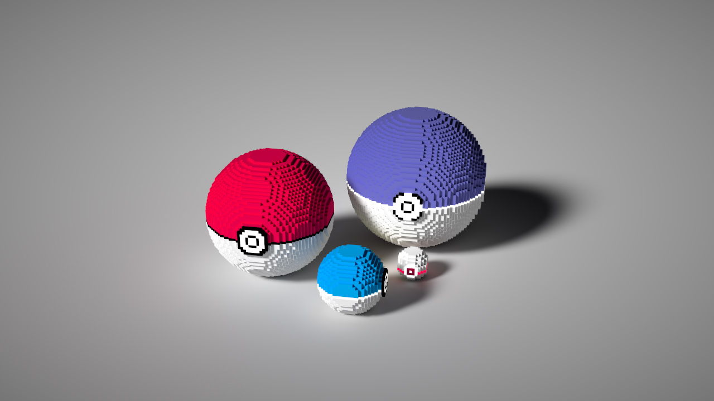
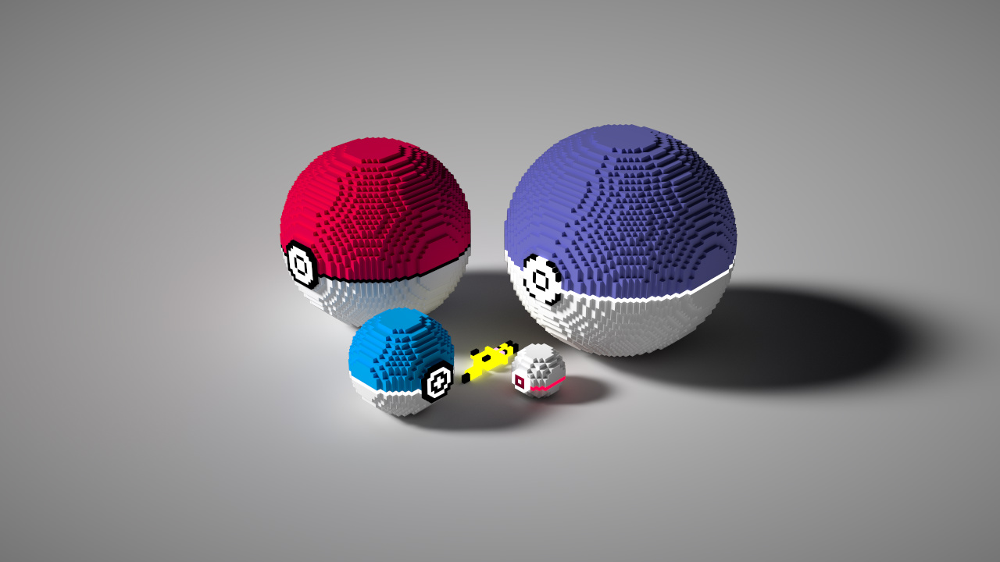
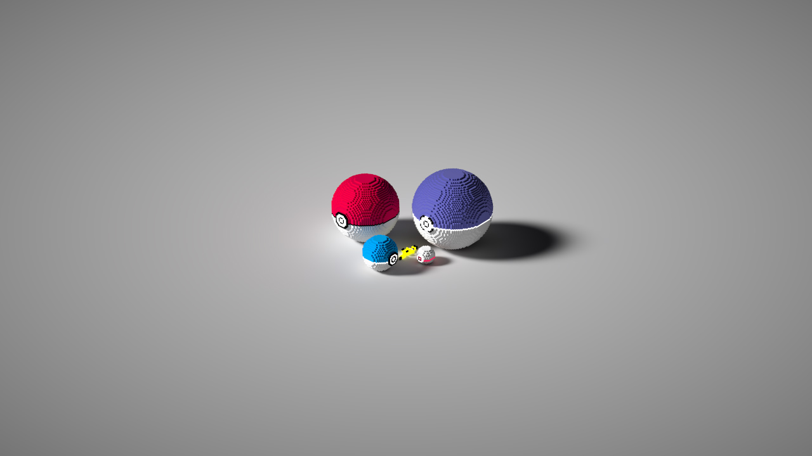
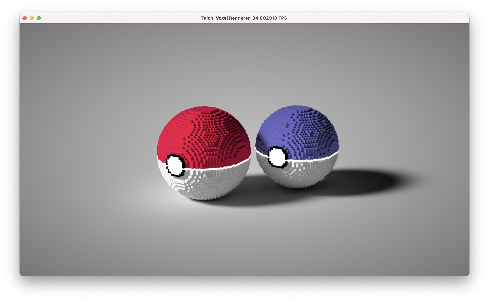

# Taichi Voxel Challenge

## Disclaimer
**Being a gameholic for almost 2 decades, my crafts are largely inspired by
the great (video) games and/or animations from differnt cultures, and I appreciate them.
If you think they have infringements concerns that directly or indirectly affect you, or
your patents, please let me know through the `Github Issues` and I will take proper 
actions ASAP.**

## Gallery

What I got at the end within 99 lines of code (in screenshots, not rendered outputs):








### Initial Iterations

What I got in 40 mins:



## Installation

Assume you have a Python 3 environment properly, you can simply run:

```sh
pip3 install -r requirements.txt
```

to install the dependendies of the voxel renderer.

Please fill in your code in `main.py` and include your result in this README.md file.

## Demo


## Quickstart

```sh
python3 example1.py  # example2/3/4.py
```

Mouse and keyboard interface:

+ Drag with your left mouse button to rotate camera.
+ Press `W/A/S/D/Q/E` to move camera.
+ Press `P` to save screenshot.

